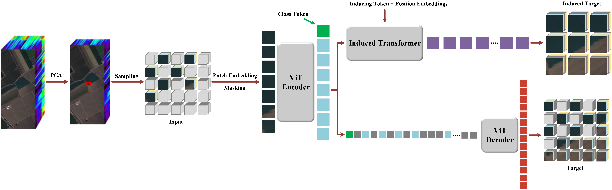
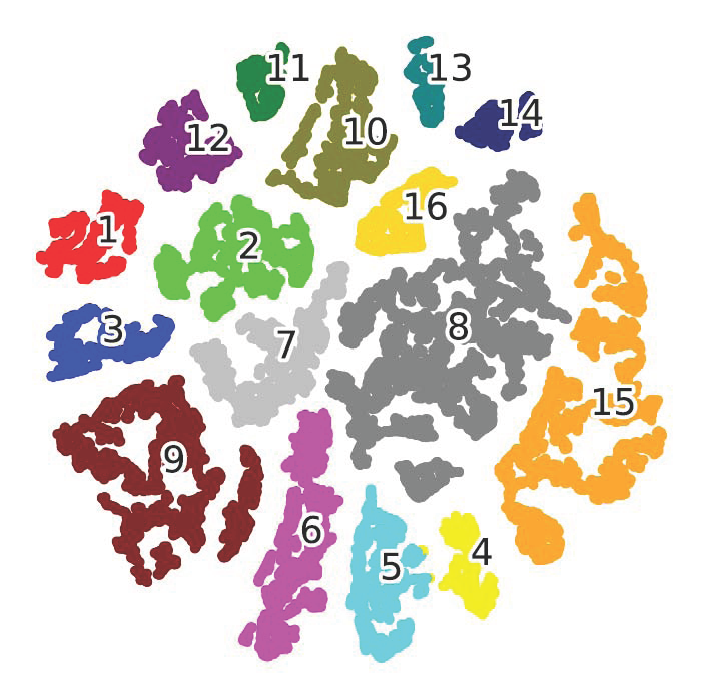

# RMAE
Regularized Masked Auto-Encoder for Semi-Supervised Hyperspectral Image Classification

Code download link: [RMAE code](https://github.com/swiftest/RMAE/archive/refs/heads/main.zip).

Here is the bibliography info:
<br/>

```jason
@article{Wang2024Regularized,  
  title={Regularized Masked Auto-Encoder for Semi-Supervised Hyperspectral Image Classification},  
  author={Wang, Liguo and Wang, Heng and Wang, Peng and Wang, Lifeng},  
  journal={IEEE Transactions on Geoscience and Remote Sensing},  
  year={2024},
  volume={62},
  pages={1-21},
  doi={10.1109/TGRS.2024.3509720},  
  publisher={IEEE}
}
```

## Steps:
- Place the target data set into the 'dataset' folder.
- Make sure the GPU accelerator is available.
- Run Semi-RMAE.ipynb in the Jupyter environment (ensure that external modules such as einops and torchsummary are installed).

## Requirements:
timm.__version__ == 0.4.5

## Descriptions

As the most prevalent self-supervised representation learning (SSRL) model, the masked auto-encoder (MAE) has been gradually investigated in semi-supervised hyperspectral image (HSI) classification (SHIC). However, the majority of the current approaches augment MAE merely from the application perspective or by introducing a weak regularization term, and do not comprehensively consider the challenges posed by the high intra-class variances and inter-class similarities that often appear in HSI data. In this article, we present a regularized MAE (RMAE) to address the aforementioned problems. Specifically, within the framework of MAE, we introduce a self-designed induced Transformer block, using a small number of visible patches to learn the embeddings of patches with larger receptive fields. The learned embeddings are used to reconstruct the corresponding patches and an induced reconstruction loss is calculated. This strategy creates a much harder task for masked image modeling (MIM), and the induced Transformer block is lightweight and imposes negligible computational burden overhead the underlying MAE framework. Additionally, by rethinking the masking operations, we develop a masked convolutional neural network (MCNN), uncovering the principle of MAE and affirming the efficacy of RMAE. Finally, we present two metrics: the mean intra-class distance, and the mean inter-class distance. Based on the metrics we give two criteria to evaluate the performance of an SSRL model, providing new coordinate for the research in SSRL-based SHIC.



Fig5. Overview of the proposed RMAE framework.




Fig13b. 2-D t-SNE embeddings of the representations learned by RMAE on the Salinas data set.

## Result

### Kennedy Space Center (KSC) Data Set

The KSC data set classification results [OA: 97.50±1.12(%), AA: 96.71±1.24(%), Kappa: 0.9721±0.013] of RMAE using random 10 samples per-class for fine-tuning.

### Houston University 2013 (HU2013) Data Set

The HU2013 data set classification results [OA: 85.43±1.12(%), AA: 87.31±0.84(%), Kappa: 0.8425±0.012] of RMAE using random 10 samples per-class for fine-tuning.

### HanChuan Data Set

The HanChuan data set classification results [OA: 90.04±1.44(%), AA: 89.08±0.81(%), Kappa: 0.8842±0.017] of RMAE using random 10 samples per-class for fine-tuning.

### Salinas Data Set

The Salinas data set classification results [OA: 94.51±1.01(%), AA: 97.69±0.54(%), Kappa: 0.9391±0.011] of RMAE using random 10 samples per-class for fine-tuning.

## Acknowledgement

The authors would like to thank the Editor, Associate Editor, and anonymous reviewers for their helpful comments and suggestions that improved this article.
